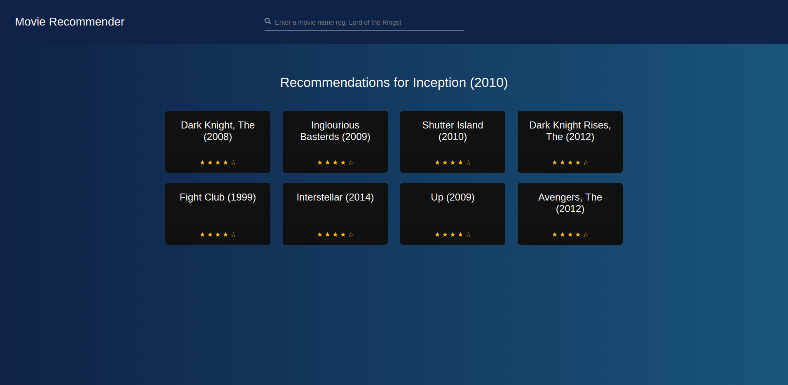

# Movie Recommendation
> A simple movie recommendation web app.

<!-- [![Python Version][python-image]][python-url]
[![Build Status][travis-image]][travis-url]
[![Downloads Stats][npm-downloads]][npm-url] -->

The project makes use of [MovieLens dataset](https://grouplens.org/datasets/movielens/) for training the recommendation engine. It uses Nearest Neighbors and Cosine similarity to cluster similar movies together.



## Installation

Linux:

```sh
git clone https://github.com/nikhil-varghese/Movie-Recommendation.git
cd Movie-Recommendation

pip install requirements.txt
python wsgi.py
```


## Release History


* 0.1.0
    * The first proper release
    * CHANGE: Get recommendations on entering movie name.
* 0.0.1
    * Work in progress
<!-- 
## Meta

Nikhil Varghese –  – nvarghese@protonmail.com

Distributed under the XYZ license. See ``LICENSE`` for more information. -->

[https://github.com/nikhil-varghese/movie-recommendation](https://github.com/nikhil-varghese/movie-recommendation)

<!-- ## Contributing

1. Fork it (<https://github.com/yourname/yourproject/fork>)
2. Create your feature branch (`git checkout -b feature/fooBar`)
3. Commit your changes (`git commit -am 'Add some fooBar'`)
4. Push to the branch (`git push origin feature/fooBar`)
5. Create a new Pull Request -->

<!-- Markdown link & img dfn's -->
[python-image]: https://img.shields.io/npm/v/datadog-metrics.svg?style=flat-square
[python-url]: https://npmjs.org/package/datadog-metrics
[npm-downloads]: https://img.shields.io/npm/dm/datadog-metrics.svg?style=flat-square
[travis-image]: https://img.shields.io/travis/dbader/node-datadog-metrics/master.svg?style=flat-square
[travis-url]: https://travis-ci.org/dbader/node-datadog-metrics
[wiki]: https://github.com/yourname/yourproject/wiki